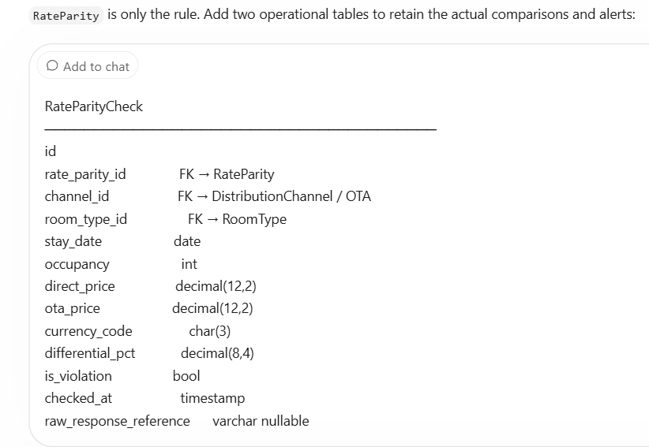
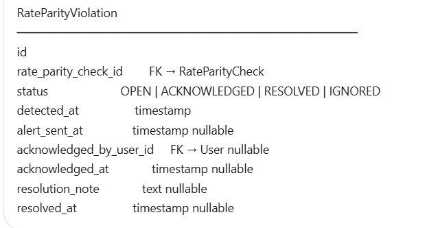

# C7 — Rate Plan Setup
> Stays Module | Core Feature 7 of 9
> Status: Final | Version: 1.0
> Validated against: Oracle OPERA, Mews, Apaleo, Cloudbeds, Booking.com API, HTNG Standard, Little Hotelier

---

## 1. What Problem Does This Solve

Every hotel needs one system to answer a single question at every booking attempt:

```
"What are you selling this room for — and under what rules?"
```

The answer is never just a price. It is a complete package:

```
WRONG (price only):
  Deluxe King = LKR 18,000/night

RIGHT (rate plan):
  Deluxe King — Executive Package
  ├── Price:              LKR 18,000/night (Dec 20-22: LKR 22,000 peak override)
  ├── Meal Plan:          Full Board (3 meals included)
  ├── Cancellation:       Free cancel until 24h before arrival
  ├── Payment:            20% deposit at booking, balance at check-in
  ├── No-show charge:     First night
  ├── Channels:           Direct, Booking.com, Agoda
  ├── Commission:         0% Direct / 15% Booking.com / 12% Agoda
  └── Package includes:   Airport transfer + Spa credit LKR 2,000
```

If the system cannot manage this cleanly:

```
No rate plan management → Manual price tracking in spreadsheets
No seasonal overrides   → Revenue loss during peak season
No cancellation policy  → Disputes with guests and refund confusion
No channel separation   → Wrong commission paid or wrong price on OTA
No audit trail          → "Who changed the rate?" — nobody knows
No derived rates        → Corporate rates drift out of sync with BAR
```

Rate Plan Setup is not a pricing screen. It is the **revenue configuration layer** every
booking, OTA connection, folio charge, and guest communication depends on.

---

## 2. Design Philosophy

```
"Simple by Default. Powerful when needed."
```

One system. Two very different users:

```
USER A: Small Guesthouse Owner
  → 2 rate plans: Flexible + Non-Refundable
  → Wants to go live in 20 minutes
  → Should never see derived rates or LOS rules

USER B: Luxury Resort Revenue Manager
  → 12+ rate plans: BAR, Corporate, VIP, Long Stay, Packages...
  → Auto-derived corporate rates, weekend multipliers
  → 5 OTA channels, inventory allocation, parity monitoring
  → Needs full control of every rate logic
```

Same 16 entities. Different depth of usage:

```
SMALL GUESTHOUSE:                     LUXURY RESORT:
Fill 3 fields → done.                 Fill 40+ fields → full control.

Rate plan: name, base_rate,           Rate plan: name, code, template,
           cancellation policy                   pricing model, meal plan,
                                                 derived from, channels,
                                                 overrides, LOS rules,
                                                 packages, audit log

System hides advanced fields.         System shows everything.
```

---

## 3. Core Concept — What Is a Rate Plan

A Rate Plan is **one complete sellable unit**. It is not a price. It is not just a policy.
It is everything bundled together that makes a room bookable on a specific channel.

```
Rate Plan = Price + Rules + Payment + Channels + Package
```

Five components, one object. When a guest books, they choose a Rate Plan — not a room type.
The room type determines which rooms are available. The rate plan determines what they pay and under what rules.

---

## 4. Rate Plan Templates

Staff doesn't build from scratch. They pick a template that pre-fills 80% of fields:

| Template | Cancellation | Payment | Typical Discount | Use Case |
|---|---|---|---|---|
| Flexible | Free cancel 24h | 20% deposit | None (full price) | Standard bookings |
| Non-Refundable | No refund | Full pay now | 15-20% off | Guests who want discount + commit |
| Advance Purchase | Free cancel 72h | Full pay now | 10-15% off | Early birds |
| Long Stay | Free cancel 48h | 30% deposit | 10-20% off | 7+ night guests |
| Bed & Breakfast | Free cancel 24h | 20% deposit | None | Breakfast included |
| Corporate | Free cancel 48h | Invoice billing | Contract rate | Verified companies |
| Custom | Staff configures all | Staff configures all | Any | Special cases |

Templates are a **starting point** — all fields can be overridden. They exist to reduce setup time.

---

## 5. Pricing Models

How the base rate is calculated depends on the property type:

| Model | Meaning | Example |
|---|---|---|
| `PER_ROOM` | Flat price for the room. Guest count does not affect price. Extra guests charged via OccupancyPricing. | LKR 18,000/night flat |
| `PER_ADULT` | Price multiplied by number of adults. Children always priced separately via OccupancyPricing. | LKR 6,500 × 2 adults = LKR 13,000 |

Most hotels use `PER_ROOM`. Resorts and full-board properties use `PER_ADULT`.
The pricing model is set on the Rate Plan and applies to all room types under it.

**Why PER_PERSON was removed:**
Industry research (OPERA, Mews, Apaleo, Cloudbeds) confirms that in every real PMS,
"per person" pricing always means "per adult" in practice — children are never multiplied
by the per-person rate. They are always priced separately via a child charge or age bucket.
PER_PERSON and PER_ADULT are identical in behaviour. Keeping both creates confusion.
PER_ADULT is the clearer term.

### How pricing_model and base_rate work together

`base_rate` is stored once in `RatePlanRoom` (per room type). It is the **unit rate**.
`pricing_model` tells the system what that unit means and how to calculate the final price.

```
final_price = base_rate × multiplier

PER_ROOM  → multiplier = 1            (guest count has no effect on room price)
PER_ADULT → multiplier = adult_count  (children always via OccupancyPricing)
```

The final price is **not stored** — it is calculated at booking time using the stored
base_rate and the guest count provided at the time of booking.

Children are NEVER multiplied by base_rate in either model. They are always priced
via OccupancyPricing.extra_child_charge or AgeBucket (if configured).

```
Example: 3 adults + 2 children, base_rate = LKR 6,500

PER_ROOM  (base_adults = 2, extra_adult_charge = LKR 1,500, extra_child_charge = LKR 500):
  Room base:      LKR 18,000  (flat)
  Extra adult:    1 × LKR 1,500 = LKR 1,500
  Extra children: 2 × LKR 500  = LKR 1,000
  Total/night:    LKR 20,500

PER_ADULT (extra_child_charge = LKR 500):
  Adults:         3 × LKR 6,500 = LKR 19,500
  Children:       2 × LKR 500   = LKR 1,000
  Total/night:    LKR 20,500
```

### Setup order — pricing_model must come first

`base_rate` meaning depends on `pricing_model`. Staff must select pricing_model
**before** entering base_rate so they know what unit they are pricing.

```
Step 1 → Select pricing_model (PER_ROOM / PER_ADULT)
Step 2 → Enter base_rate per room type

UI label on base_rate field changes based on selection:
  PER_ROOM  → "Rate per room / night"
  PER_ADULT → "Rate per adult / night"
```

### pricing_model is locked on ACTIVE plans

Changing pricing_model after base_rate is set would make the stored value meaningless.

```
Example of the problem:
  Staff sets base_rate = 6,000 as a per-person rate (PER_PERSON)
  Staff changes pricing_model to PER_ROOM
  System now charges LKR 6,000 flat for the entire room — wrong.
```

Rule: `pricing_model` **cannot be changed on an ACTIVE plan.**
To change it: archive the plan and create a new one, or work in DRAFT before activation.

---

## 6. The 16 Entities

### Entity 1: `RatePlan` — Master Record

The root entity. Every other entity connects to this.

```
id
business_id

name                  "Executive Package" / "BAR Standard" / "MAS Holdings Corporate"
code                  "EXP" / "BAR" / "MAS-CORP"
                      Internal code used in audit logs, OTA sync, reports.
                      Auto-suggested from name. Staff can override.

template_type
  → FLEXIBLE / NON_REFUNDABLE / ADVANCE_PURCHASE / LONG_STAY /
    BED_BREAKFAST / CORPORATE / CUSTOM

  System-level enum. Each value maps to a hardcoded pre-defined config
  in application code (not a DB table). When staff selects a template,
  the system auto-fills 80% of fields. All fields remain editable after.

  Template definitions (application constants):
    FLEXIBLE         → cancel: free until 24h | payment: 20% deposit   | discount: none
    NON_REFUNDABLE   → cancel: no refund       | payment: full pay now  | discount: 15-20% off
    ADVANCE_PURCHASE → cancel: free until 72h  | payment: full pay now  | discount: 10-15% off
    LONG_STAY        → cancel: free until 48h  | payment: 30% deposit   | discount: 10-20% off
    BED_BREAKFAST    → cancel: free until 24h  | payment: 20% deposit   | meal: BREAKFAST
    CORPORATE        → cancel: free until 48h  | payment: invoice        | discount: contract rate
    CUSTOM           → staff configures all fields manually

  This column is stored in DB to record which template was used as the
  starting point — used in audit logs and UI display only.
  Template definitions change via code deploy, not DB migration.

pricing_model         PER_ROOM / PER_ADULT
                      PER_ROOM  = flat room price. Extra guests via OccupancyPricing.
                      PER_ADULT = price × adult count. Children always via OccupancyPricing.

meal_plan
  → ROOM_ONLY         No meals included
  → BREAKFAST         Bed & Breakfast (B&B)
  → HALF_BOARD        Breakfast + Dinner (HB)
  → FULL_BOARD        Breakfast + Lunch + Dinner (FB)
  → ALL_INCLUSIVE     Meals + beverages + activities (AI)

meal_charge_per_night decimal nullable
                      If meal plan has a cost separate from base rate,
                      this amount posts to folio independently.
                      Allows correct tax split: room tax vs F&B tax.

visibility
  → PUBLIC            Shown on hotel website, booking widget, OTAs
  → PRIVATE           Requires promo code to access.
  A guest must enter a valid promotional or access code during booking to see and select it.
     Example:
        Rate: Weekend Special
        Visibility: PRIVATE
        Promo code: WEEKEND25
        Without WEEKEND25, the guest only sees regular public rates. With it, they can see and book the private discounted rate.
  → CORPORATE         Shown only to linked corporate accounts

status
  → DRAFT             Work in progress. Not shown to guests. Not synced to OTAs.
                      ← Industry gap: OPERA / Mews / Cloudbeds have no DRAFT state.
                         Hotels cannot safely edit live rates without risk.
                         We solve this.
  → ACTIVE            Live and bookable.
  → ARCHIVED          Retired. Rate plans with past bookings cannot be deleted.
                      Archive preserves history.

is_active             bool. Quick disable without archiving.
display_order         int. Controls order shown in UI and booking widget.
currency_code         "LKR" / "USD" / "EUR". Inherited from hotel, override per plan.Needed for dual currency economies
advance_purchase_min_days  int nullable. Advance Purchase template: must book X days before.
advance_purchase_min_days defines how far in advance a guest must book to qualify for the rate.
For xample, advance_purchase_min_days = 7
A guest can book the rate only if their check-in date is at least 7 days away. For example, on 1 June, the earliest eligible check-in is 8 June.
It is nullable because many rates have no advance-purchase restriction:
tax_profile_id        FK → TaxProfile nullable. If null: hotel default tax applies.
tax_profile_id identifies the tax rule set to apply to that specific rate.
tax_profile_id = 12  → “Reduced Accommodation Tax”
If it is NULL, the system uses the hotel’s default tax profile instead. This lets you override normal tax treatment only for special rate plans, such as corporate, tax-exempt, or region-specific rates.

created_at / updated_at
```

**Why DRAFT status is an innovation:**
```
WITHOUT DRAFT (OPERA, Mews, Cloudbeds):
  Staff edits live rate plan → immediately visible to guests → risk of wrong rate going live.
  Hotels resort to: "change it at 2 AM when no one is booking."

WITH DRAFT (us):
  Staff builds rate plan in DRAFT → QA check → GM approval → Activate.
  Zero risk of unfinished rate plan going live.
  Multiple staff can prepare seasonal plans weeks in advance.
```

---

### Entity 2: `RatePlanRoom` — Price Per Room Type

Each rate plan must have a price set for each room type it applies to.

```
id
rate_plan_id          FK → RatePlan
room_type_id          FK → RoomType

base_rate             decimal. The nightly rate for this room type under this plan.

  ⚠️ READ-ONLY FOR DERIVED PLANS:
  If this rate plan is derived from a parent, base_rate is auto-calculated
  by DerivedRatePlan formula. Staff cannot manually edit it.
  The DerivedRatePlan entity OWNS the formula. RatePlanRoom just stores the result.


  HOW TO IMPLEMENT DERIVED PLAN?
  RatePlan
- id
- name
- parent_rate_plan_id nullable
- pricing_mode: MANUAL | DERIVED

DerivedRatePlan
- id
- rate_plan_id             FK → child RatePlan
- parent_rate_plan_id      FK → parent RatePlan
- adjustment_type          PERCENTAGE | FIXED_AMOUNT
- adjustment_value         decimal
- rounding_rule             optional

Example record:
child_rate_plan       = Non-Refundable Rate
parent_rate_plan      = Flexible Rate
adjustment_type       = PERCENTAGE
adjustment_value      = -15

Calculation:
derived price = parent base_rate × (1 + adjustment_value / 100)
So:
$200 × (1 - 15 / 100) = $170

Typical ways to derive a plan:
Early Booker      = Flexible Rate − 10%
Non-Refundable    = Flexible Rate − 15%
Weekend Premium   = Flexible Rate + 20%
Corporate Rate    = Flexible Rate − fixed $25

RatePlanRoom.base_rate for a derived plan is read-only because it stores the calculated result for fast searching and auditing. When creating a derived plan, choose the parent plan and set the adjustment formula; then create/update RatePlanRoom records by calculating prices for every active room type in the parent.

is_active             bool. Include/exclude this room type from this rate plan.
```

**How it works:**
```
Rate Plan "BAR(Best Available Rate) Standard" × 4 room types = 4 RatePlanRoom rows

room_type        base_rate
──────────────────────────
Standard Double  LKR 12,000
Deluxe King      LKR 18,000
Superior Twin    LKR 15,000
Suite            LKR 35,000
```

---

### Entity 3: `RatePlanDateOverride` — Seasonal / Holiday Pricing
HAVE TO CONSIDER ABOUT THE RECURRENCE.........

Override the base rate for specific date ranges. Christmas pricing, Sinhala New Year,
Valentine's Day. Also controls date-based restrictions Close to Arrival(CTA)/Close to Departure(CTD).

```
id
rate_plan_id          FK → RatePlan
room_type_id          FK → RoomType nullable
                      null = override applies to ALL room types under this plan
                      set = override applies to ONE room type only

override_name         "Christmas Peak" / "Sinhala New Year" / "Valentine's Day"

date_from             date. Start of override range. (inclusive)
date_to               date. End of override range. (inclusive)

override_type
  → FIXED_RATE        Rate becomes this exact amount for the range.
  → MULTIPLIER        Rate × this multiplier (e.g., ×1.20 = 20% above base).
  → ADJUSTMENT        Base rate ± this amount (e.g., +LKR 2,000).

override_rate         decimal nullable. Used when FIXED_RATE.
override_multiplier   decimal nullable. Used when MULTIPLIER.
override_adjustment   decimal nullable. Used when ADJUSTMENT.

closed_to_arrival     bool. CTA — no new check-ins on these dates.
                      Example: peak night (Dec 24) — guests must arrive Dec 23 or earlier.
closed_to_departure   bool. CTD — no check-outs on these dates.
                      Example: New Year's Eve — guests must stay through.

priority              int. If two overrides overlap, higher priority number wins.
```

**DateOverride vs DayRule — which wins?**
```
If a date has BOTH a DateOverride and a DayRule (weekend multiplier):
  → DateOverride WINS. Day rule is ignored for that date.

Reason: DateOverride is an explicit decision ("this exact date = LKR 22,000").
        DayRule is a general pattern ("Saturdays are 10% higher").
        Explicit beats general. Always.
```

---

### Entity 4: `RatePlanDayRule` — Weekday / Weekend Multipliers

Auto-apply a price multiplier based on day of week. Set once → applies every week automatically.
Avoids creating 52 individual date overrides for every Saturday.

```
id
rate_plan_id          FK → RatePlan
room_type_id          FK → RoomType nullable. null = all room types.

rule_name             "Weekend Rate" / "Weekday Rate"
days_of_week          array. ["MON","TUE","WED","THU","FRI","SAT","SUN"]
multiplier            decimal. 1.15 = 15% higher. 0.90 = 10% lower.
valid_from            date nullable. Rule active only from this date.
valid_until           date nullable. Rule expires after this date.
                      null on both = rule is always active.
is_active             bool.
```

**Phase 2.** V1 hotels set prices manually per date range.

---

### Entity 5: `RatePlanLOSRule` — Length of Stay Rules

Control booking behavior based on number of nights. Also supports LOS-based CTA/CTD.

```
id
rate_plan_id          FK → RatePlan

rule_name             "Christmas Minimum Stay" / "Weekend Minimum"
min_nights            int nullable. Guest must book at least this many nights.
max_nights            int nullable. Guest cannot book more than this many nights.

arrival_days          array nullable. Rule only applies when check-in is on these days.
                      ["FRI","SAT"] = weekend arrivals must follow this rule.

closed_to_arrival     bool. CTA via LOS — cannot arrive if LOS check fails.
closed_to_departure   bool. CTD via LOS — cannot depart if LOS check fails.

valid_from / valid_until   date nullable. Date range this rule is active.
is_active             bool.
```

**CTA in two entities — when to use which:**
```
DateOverride.closed_to_arrival  → Use when a specific DATE is blocked.
                                  "Dec 24: no new arrivals."

LOSRule.closed_to_arrival       → Use when a LENGTH OF STAY doesn't meet the rule.
                                  "Arrivals on Fri must stay at least 2 nights."

Both are checked independently. Either being true = booking blocked.
```

**Phase 2.** V1 hotels do not need LOS restriction management.

---

### Entity 6: `OccupancyPricing` — Extra Guest Charges

What to charge when a room has more guests than the base occupancy.
Also defines how many guests are included in the base room rate.

```
id
rate_plan_id          FK → RatePlan
room_type_id          FK → RoomType nullable. null = applies to all room types.

base_adults           int. default 2. How many adults are included in base_rate.
                      Extra adults beyond this count = extra_adult_charge applies.
                      Industry default = 2 (double occupancy as baseline).

base_children         int. default 0. How many children are included in base_rate.
                      Extra children beyond this count = extra_child_charge applies.
                      Most hotels set this to 0 (children always charged extra).

extra_adult_charge    decimal nullable. Per additional adult per night,
                      beyond base_adults count.

extra_child_charge    decimal nullable. Flat charge per child per night.
                      Used as fallback when no AgeBucket is configured.
                      If AgeBucket records exist for this rate plan → AgeBucket wins.

child_age_limit       int nullable. "Child" is anyone up to this age.
                      Guest above this age = treated as adult for pricing.

max_occupancy_override  int nullable. Allows this rate plan to override
                        the room type's max occupancy.
                        Example: Room type max = 5. Corporate rate allows up to 3.
```

**Calculation logic — PER_ROOM example:**
```
base_adults = 2, base_rate = LKR 18,000
extra_adult_charge = LKR 1,500, extra_child_charge = LKR 500

Booking: 3 adults + 2 children
  Room base:      LKR 18,000         (covers 2 base adults)
  Extra adult:    1 × LKR 1,500      (3rd adult beyond base_adults = 2)
  Children:       2 × LKR 500        (no children in base_children = 0)
  Total/night:    LKR 20,500
```

**Child charge fallback rule:**
```
if AgeBucket records exist for this rate plan:
    use AgeBucket rate matched to child's age
else:
    use extra_child_charge flat rate
```
This makes age bucket configuration optional. Small hotels set one flat extra_child_charge.
Resorts configure AgeBuckets for age-tiered pricing. Both work with the same entity.

---

### Entity 7: `AgeBucket` — Age-Tiered Child Pricing

Optional. When configured, overrides OccupancyPricing.extra_child_charge for children
whose age falls within the bucket. Allows different rates for infants, children, and teens.

If NO AgeBucket records exist for a rate plan → flat extra_child_charge applies (fallback).
If AgeBucket records exist → system matches child's age and applies that bucket's charge.

```
id
rate_plan_id          FK → RatePlan
room_type_id          FK → RoomType nullable. null = applies to all room types.

bucket_name           "Infant" / "Child" / "Teen"
min_age               int. Minimum age (inclusive) for this bucket.
max_age               int. Maximum age (inclusive) for this bucket.
charge_per_night      decimal. 0.00 = free. Set per bucket.

is_active             bool.
```

**Industry standard age tiers (recommended defaults, configurable):**
```
Bucket      min_age   max_age   charge
──────────────────────────────────────────
Infant        0         2        0.00  (free — no bed, no occupancy count)
Child         3        11       LKR 500
Teen         12        17       LKR 1,200
```

**How it replaces flat extra_child_charge:**
```
Booking: 2 children — age 1 (infant) + age 8 (child)

With AgeBucket:
  Age 1 → Infant bucket → LKR 0
  Age 8 → Child bucket  → LKR 500
  Child total: LKR 500

Without AgeBucket (flat):
  extra_child_charge = LKR 500
  Both children → 2 × LKR 500 = LKR 1,000
```

**Business user — optional setup:**
```
Small hotel → skip AgeBucket entirely. Set one flat extra_child_charge. Done.
Resort      → configure 3 buckets. System auto-applies correct rate per child age.
```

---

### Entity 8: `CancellationPolicy` — Reusable Cancel Rules

**Single source of truth for all cancellation and no-show rules.**
Created once → reused across many rate plans.

```
id
business_id
name                  "Flexible 24H" / "Non-Refundable" / "Peak Season Strict"

policy_type
  → FREE_UNTIL        Free cancel until X hours before arrival.
  → NON_REFUNDABLE    No refund under any circumstance.
  → PARTIAL           Guest pays a percentage if cancelled within window.
  → TIERED            Multiple rules with different windows (Phase 2).

free_cancel_until_hours   int nullable. Used for FREE_UNTIL.
                          24 = free cancel until 24 hours before check-in.

partial_charge_type   PERCENTAGE / FLAT_AMOUNT. Used for PARTIAL.
partial_charge_value  decimal nullable. Penalty amount if cancelled in window.
partial_window_hours  int nullable. Window start for penalty (hours before arrival).

date_change_allowed   bool. Can guest change their dates instead of cancelling?
date_change_fee       decimal nullable. Fee charged for date change.
date_change_window_hours  int nullable. 
date_change_anchor = AFTER_BOOKING/BEFORE CHECKIN

is_system_default     bool. One policy is the hotel default for new rate plans.
```

> **Note:** No-show rules live in a separate `NoShowPolicy` entity (Entity 8b).
> `CancellationPolicy` handles cancellation only. No-show is a different event
> (guest doesn't communicate and simply fails to arrive), so it gets its own
> reusable policy and entity.

**Why CancellationPolicy is separate (not embedded in RatePlanPolicy):**
```
PROBLEM WITHOUT REUSABILITY:
  Hotel has 8 rate plans. All use "Flexible 24H" cancel policy.
  Guest calls: "Can I change my booking?"
  Staff changes the policy window from 24h to 48h.
  They must open all 8 rate plans and update one by one.
  Miss one → inconsistent policy → potential dispute.

OUR SOLUTION:
  CancellationPolicy is its own entity.
  Update the policy once → all 8 rate plans reflect the change immediately.
  No risk of inconsistency.
```

**Why no_show was extracted into its own entity:**
```
Previously considered: no_show_charge in CancellationPolicy.
Removed. Reason: a no-show is not the same as a cancellation.

CANCELLATION  → Guest communicates before arrival. Booking is cancelled.
NO-SHOW       → Guest simply does not arrive. No communication. Booking
                silently expires at the cut-off time.

Different events → different rules → different entities.

CONSEQUENCES OF KEEPING THEM TOGETHER:
  - Hot mixable scenarios: "No refund if cancelled within 24h, but no-show
    charges first night" — these are different windows, different triggers,
    and often different commercial treatments.
  - Audit reports get noisy: "Was it a cancel or a no-show?" requires
    digging into the same record.
  - Reporting loses precision: revenue managers want to see no-show rates
    separately from cancellation rates to measure demand vs fulfilment.

OUR SOLUTION:
  NoShowPolicy is its own entity (Entity 8b). Reusable, like CancellationPolicy.
  CancellationPolicy handles cancellation only.
  NoShowPolicy handles no-show only.
  Both are linked from RatePlanPolicy.

This separation also mirrors industry practice (OPERA, Mews, Apaleo all model
no-show as a distinct configurable charge).
```

---

### Entity 8b: `NoShowPolicy` — Reusable No-Show Rules

**Single source of truth for all no-show rules.** Created once → reused across many rate plans.
A no-show is when the guest fails to arrive without cancelling — a different event from cancellation,
so it gets its own policy and its own entity.

```
id
business_id
name                  "First Night No-Show" / "Full Stay No-Show" / "Strict No-Show"

charge_type
  → NONE              No charge if guest doesn't arrive.
  → FIRST_NIGHT       Charge the first night's rate.
  → FULL_STAY         Charge the entire booking.
  → FLAT_AMOUNT       Charge a fixed amount.

flat_amount           decimal nullable. Used when charge_type = FLAT_AMOUNT.

cut_off_time          time. The clock time on the arrival date after which an
                      unarrived booking is marked as no-show.
                      Example: 18:00 → a guest who hasn't checked in by 6 PM
                      on the arrival date is flagged no-show.

grace_period_minutes  int nullable. Minutes of buffer after cut_off_time before
                      the no-show charge is actually posted to the folio.
                      Example: cut_off_time = 18:00, grace_period = 120 →
                      charge posts at 20:00. Allows front desk to handle
                      late walk-ins without immediately billing.

auto_mark_no_show     bool. true = system automatically flags unarrived bookings
                      as no-show at cut_off_time + grace_period.
                      false = front desk must manually mark (useful for properties
                      where late arrivals are common and expected).

waivable             bool. true = GM/manager can waive the charge manually.
                     false = charge is hard — cannot be waived without DB override.

is_system_default     bool. One policy is the hotel default for new rate plans.
```
waivable = true (Soft Charge): A General Manager or authorized manager has the software permission to waive, discount, or remove the charge directly within the application (e.g., as a customer service gesture).

waivable = false (Hard Charge): The system completely blocks users—including upper management—from removing the fee through the application UI. The only way to alter or remove it is through a direct, backend database override (UPDATE/DELETE query by a database administrator).

**Why this is its own entity:**
```
REUSE ACROSS RATE PLANS:
  Hotel has 8 rate plans. All use "First Night No-Show".
  GM wants to change the cut-off from 18:00 to 20:00 globally.
  Update NoShowPolicy once → all 8 rate plans reflect the change immediately.
  No risk of inconsistency.

INDEPENDENT FROM CANCELLATION:
  A rate plan can have:
    CancellationPolicy = "Free until 24h, then first night"
    NoShowPolicy       = "Full stay, no grace period"
  These are independent rules for independent events.

REPORTING CLARITY:
  Revenue manager dashboard splits:
    - Cancellation rate
    - No-show rate
  Each metric measured separately. Different business levers.
```

**Trigger flow — when does a no-show charge get posted?**
```
1. Booking arrival date arrives.
2. Front desk does NOT check the guest in.
3. At cut_off_time (e.g., 18:00) — system starts the grace timer.
4. At cut_off_time + grace_period_minutes (e.g., 20:00) — system:
   a. Marks booking status = NO_SHOW (if auto_mark_no_show = true).
   b. Posts the configured charge (FIRST_NIGHT / FULL_STAY / FLAT_AMOUNT)
      to the guest folio as a No-Show Fee line item.
   c. Logs the action in RatePlanAuditLog.
5. If auto_mark_no_show = false, a NO_SHOW_PENDING flag is shown to front
   desk. Staff can either:
     - Check the guest in (clears the flag).
     - Manually confirm no-show → charge posts.
     - Manually waive → no charge, logged as waived.
```

---

### Entity 9: `RatePlanPolicy` — Operational Rules

Check-in/out times, child policy, pet policy for this specific rate plan.
Overrides hotel-level defaults where needed.

```
id
rate_plan_id          FK → RatePlan (1:1)

check_in_from         time nullable. null = inherit hotel default.
check_out_until       time nullable. null = inherit hotel default.

child_policy_type
  → NO_CHILDREN       Rate plan does not allow children.
  → FREE_UNDER_AGE    Children below X age stay free.
  → CHARGE_ALL        All children charged at extra_child_charge rate.

child_free_age_limit  int nullable. Children at or below this age stay free.

is_pet_friendly       bool nullable. null = inherit from room type setting.
                      true  = this rate plan allows pets (if room type also allows).
                      false = pets not allowed even if room type is pet-friendly.
pet_fee_per_night     decimal nullable. Additional charge if pet brought.

early_check_in_fee    decimal nullable.
late_check_out_fee    decimal nullable.

special_instructions  text nullable.
                      "Corporate guests: billing to company account required."
                      "Advance Purchase: no date change allowed."
```

**Pet policy — 3 levels:**
```
Level 1: RoomType.is_pet_friendly        Does the physical room allow pets?
Level 2: Room.is_pet_friendly_override   Override per individual room.
Level 3: RatePlanPolicy.is_pet_friendly  Does this rate plan allow pets?
         + pet_fee_per_night             How much extra?

All three must allow → pet permitted.
If any level says no → pet not permitted.
```

---

### Entity 10: `RatePlanPayment` — Payment Collection Config

How and when payment is collected for bookings under this rate plan.

```
id
rate_plan_id          FK → RatePlan (1:1)

collection_type
  → FULL_AT_BOOKING       100% charged immediately at reservation.
  → DEPOSIT_AT_BOOKING    Partial deposit now, balance later.
  → FULL_AT_CHECKIN       No charge until guest arrives.
  → INVOICE_ON_CHECKOUT   Corporate: bill sent after stay. No advance payment.

deposit_percentage    decimal nullable. Percentage for DEPOSIT_AT_BOOKING.
                      20 = 20% of total booking amount.

deposit_due_days      int nullable. Days after booking when deposit is due.
                      0 = collect immediately. 3 = collect within 3 days of booking.

balance_due
  → AT_CHECKIN        Balance charged when guest arrives.
  → AT_CHECKOUT       Balance charged when guest departs.
  → X_DAYS_BEFORE     Balance due X days before check-in (advance payment).

balance_due_days      int nullable. Used when balance_due = X_DAYS_BEFORE.

refund_policy_days    int nullable. Days within which refund is processed.
```

---

### Entity 11: `RatePlanChannel` — Channel Distribution

Controls which channels (OTAs, direct) sell this rate plan.
Each row = one rate plan × one channel combination.

```
id
rate_plan_id          FK → RatePlan
channel_id            FK → Channel (Entity 15)
                      ← FK to Channel master table, NOT a hardcoded enum.
                         New OTA = insert one row in Channel table. Zero code change.

channel_rate_plan_code  varchar nullable.
                        The code OTA uses for this rate plan on their platform.
                        Booking.com calls this "rate plan code" in their API.
                        Required for OTA sync accuracy.

commission_percentage   decimal. Default pre-filled from Channel.default_commission_pct.
                        Staff overrides per rate plan as needed.
                        Example: Booking.com default 15%, but this plan negotiated 12%.

commission_model
  → HOTEL_PAYS        Hotel remits commission to OTA. Guest pays hotel rate.
  → GUEST_PAYS        Commission added on top of hotel rate for guest.
  → NET_RATE          OTA marks up from hotel's net rate (wholesale).

inventory_allocation  int nullable. Max rooms per night this channel can sell.
                      null = no limit (OTA sees full availability).
                      Phase 2: Channel Manager (A1) manages this dynamically.

is_active             bool. Enable/disable this channel without deleting the record.
```

---

### Entity 12: `RateParity` — Price Consistency Monitoring

Monitors that this rate plan's price doesn't appear cheaper on OTAs than on the hotel's
direct channel. Protects direct booking margin.

```
id
rate_plan_id          FK → RatePlan (1:1)

parity_rule
  → MATCH_DIRECT      OTA price must be ≥ direct channel price.
  → ALLOW_DIFFERENTIAL  OTA can be X% different (buffer).
  → NO_MONITORING     Hotel not enrolled in parity monitoring.

max_allowed_differential_pct   decimal nullable. Buffer %. 5 = OTA can be up to 5% lower.
alert_threshold_pct            decimal nullable. Alert GM when differential exceeds this %.
last_checked_at                timestamp.
last_violation_detected_at     timestamp nullable.
```

**Phase 2.** V1 does not actively monitor parity.
A practical flow:
1. Scheduled job runs, e.g. every 6 hours.
2. Get the direct-channel price from your own rate/availability engine.
3. Get OTA prices from channel-manager APIs, OTA APIs, or controlled rate shopping.
4. Normalize currency, taxes, fees, and booking conditions.
5. Calculate the difference.
6. Save the check result.
7. Create an alert if it violates the configured rule.


Difference formula:
differential_pct = ((direct_price - ota_price) / direct_price) × 100

Example:
Direct price = LKR 20,000
OTA price    = LKR 18,000

differential_pct = ((20,000 - 18,000) / 20,000) × 100
                 = 10%
The OTA is 10% cheaper.

Rule evaluation:
MATCH_DIRECT
  Violation when OTA price < direct price.

ALLOW_DIFFERENTIAL
  Violation when differential_pct > max_allowed_differential_pct.

NO_MONITORING
  Do not run or evaluate parity checks for this rate plan.

For example:
parity_rule                   = ALLOW_DIFFERENTIAL
max_allowed_differential_pct  = 5
alert_threshold_pct           = 8
- OTA 3% cheaper → allowed, no violation.
- OTA 6% cheaper → violation, record it.
- OTA 9% cheaper → violation and send an alert to the GM.




Update the fields in RateParity after every completed job:
last_checked_at              = current timestamp
last_violation_detected_at   = current timestamp  // only when a violation occurs
One important dependency: you need a mapping between your internal RatePlan / RoomType and each OTA’s rate and room identifiers. Without that mapping, the system cannot reliably compare the correct products.
---

### Entity 13: `DerivedRatePlan` — Auto-Cascade Pricing

Defines how one rate plan is automatically calculated from another.
The child rate plan's prices update automatically when the parent changes.

```
id
parent_rate_plan_id   FK → RatePlan. The base plan (e.g., BAR).
child_rate_plan_id    FK → RatePlan. The derived plan (e.g., Corporate).

adjustment_type
  → PERCENTAGE        Child rate = parent rate ± percentage.
  → FLAT_AMOUNT       Child rate = parent rate ± flat amount.

adjustment_value      decimal. Positive = higher than parent. Negative = lower.
                      Example: -15 with PERCENTAGE → child is 15% below parent.

round_to              int nullable. Round derived rate to nearest X.
                      100 = round to nearest LKR 100. 500 = nearest LKR 500.
                      Clean prices. Not "LKR 10,165".

is_active             bool.
```

**Derivation chain — how it works:**
```
EXAMPLE: Hotel sets BAR = LKR 12,000. Corporate is always 15% below BAR.
         VIP Corporate is always 10% below Corporate.

  BAR Standard:         LKR 12,000   (set manually by revenue manager)
  ↓ DerivedRatePlan (-15%)
  Corporate:            LKR 10,200   (auto-calculated)
  ↓ DerivedRatePlan (-10%)
  VIP Corporate:        LKR  9,180   (auto-calculated)

  BAR changes to LKR 14,000:
  → Corporate auto-updates to LKR 11,900
  → VIP Corporate auto-updates to LKR 10,710
  → No manual work by staff. No risk of drift.
```

**Circular chain prevention (required):**
```
RatePlan A → derives from → RatePlan B → derives from → RatePlan A
This is a circular dependency. Infinite loop. System crash.

Prevention: Before every DerivedRatePlan save, application checks:
  "Does the proposed parent chain ever reach the child_rate_plan_id?"
  If yes → reject with error: "Circular derivation chain detected."
  Database FK alone CANNOT catch this. Must be application-level logic.
```

---

### Entity 14: `PackageInclusion` — Bundled Services

Defines what is included in a package rate plan beyond just the room.
Controls how inclusions appear on folio, trigger housekeeping tasks,
and split revenue between departments.

```
id
rate_plan_id          FK → RatePlan

service_name          "Breakfast" / "Airport Transfer" / "Spa Credit" / "Fruit Basket"
service_description   text nullable.

quantity_basis
  → PER_ROOM          One unit per room. Fruit basket = 1 per room.
  → PER_PERSON        One per guest. Meal = charged per person.
  → PER_ADULT         One per adult only. Spa credit = per adult.
  → PER_COUPLE        One per couple (max 2 adults). Champagne welcome = 1 bottle.

quantity              int. How many units.

unit_price            decimal nullable. 0 or null = included in package price.
                      Set > 0 = extra charge posted separately to folio.

frequency
  → DAILY             Posted every night of stay. Parking, meals.
  → AT_CHECKIN        Posted once at arrival. Airport transfer, welcome basket.
  → AT_CHECKOUT       Posted at departure.
  → MANUAL            Guest redeems at department. Spa credit, dining voucher.

folio_post_trigger    How the charge (if any) appears on the guest folio.
revenue_center        ROOMS / FB / SPA / TRANSPORT / PARKING / OTHER
                      Revenue attribution for department P&L.
                      F&B items → Restaurant P&L.
                      Rooms items → Rooms P&L.
                      (OPERA concept: revenue reporting by department.)

creates_task          bool. true = auto-creates housekeeping/department task.
task_department       which department receives the task.
task_instructions     text nullable. "Place fruit basket in room before check-in."
```

**PER_COUPLE explained:**
```
WHY PER_COUPLE EXISTS:
  Welcome champagne, romantic dinner for two, honeymoon decoration.
  These are PER couple, not PER person.
  If 3 people book: PER_PERSON = 3 units. PER_COUPLE = 1 unit (for 2 adults).

  Without PER_COUPLE: quantity_basis = PER_PERSON → wrong amount for romance packages.
  With PER_COUPLE:    always 1 unit regardless of room occupancy (up to 2 adults).
```

**Revenue center example:**
```
Executive Package includes:
  - Room (3 nights LKR 25,000)      → ROOMS P&L
  - Full Board (3 nights)           → FB P&L
  - Airport Transfer (1 way)        → TRANSPORT P&L
  - Fruit basket                    → ROOMS P&L (housekeeping task)
  - Parking (3 nights LKR 500)      → PARKING P&L

Night audit auto-posts to correct department.
Setup once → auto-splits forever.
```

---

### Entity 15: `RatePlanAuditLog` — Full Change History

Every change to every rate plan is recorded. Who changed what, when, and why.
Also shows how many future bookings are affected before confirming the change.

```
id
business_id
rate_plan_id          FK → RatePlan
changed_by_staff_id   FK → Staff
changed_at            timestamp

change_type
  → RATE_CHANGED / POLICY_CHANGED / CHANNEL_ADDED / CHANNEL_REMOVED /
    STATUS_CHANGED / DATE_OVERRIDE_ADDED / LOS_RULE_CHANGED /
    PACKAGE_ADDED / COMMISSION_CHANGED

entity_changed        "RatePlanRoom" / "CancellationPolicy" / "RatePlanChannel" ...
field_changed         "base_rate" / "min_nights" / "commission_percentage" ...
old_value             text. What it was before. "12000"
new_value             text. What it became. "14000"

change_reason         text nullable. "Peak season rate increase — approved by GM."

booking_impact_count  int. Number of future bookings using this rate plan.
                      AUTO-CALCULATED before change is saved.
                      Warning shown: "This change affects 12 future bookings. Proceed?"
                      Staff must acknowledge before saving.
```

**Why this matters (no competitor has this):**
```
SCENARIO 1: Owner asks accounting
  "Who raised the corporate rate in October?"
  AuditLog → changed_by: Meena, Oct 14, 10:23 AM
              LKR 14,000 → LKR 16,000, reason: "Q4 rate revision"

SCENARIO 2: Guest dispute
  "Guest says they were quoted LKR 12,000 but billed LKR 14,000"
  AuditLog → rate changed Oct 15. Guest booked Oct 12.
              Booking used original rate. Billing error confirmed. Refund LKR 2,000.

SCENARIO 3: OTA dispute
  "Booking.com says our rate was wrong on Nov 20"
  AuditLog → commission changed Nov 18 from 12% → 15%. Channel sync fired Nov 18.
              Hotel made the change. Evidence clear. Not OTA error.
```

---

### Entity 16: `Channel` — Distribution Channel Master Table

Master table of all distribution channels. Replaces hardcoded enum in `RatePlanChannel`.
Adding a new OTA = insert one row. Zero code change. Zero deployment.

```
id
business_id             nullable. null = system-level channel (available to all hotels).
                      set = hotel-specific custom channel.

name                  "Booking.com" / "Agoda" / "Direct"
code                  "BOOKING_COM" / "AGODA" / "DIRECT"

channel_type
  → DIRECT            Hotel's own booking (website, walk-in, phone, staff)
  → OTA               Third-party booking platform with commission
  → GDS               Global Distribution System (Sabre, Amadeus) — Phase 3
  → WHOLESALE         Bed banks, tour operators — Phase 2
  → CORPORATE         Direct corporate booking portal — Phase 2

api_integration       nullable. BOOKING_COM_API / AGODA_API / EXPEDIA_API / AIRBNB_API ...
                      null = channel exists, no API integration yet (manual sync).
                      Used by Channel Manager add-on (A1) to select sync adapter.

commission_model      HOTEL_PAYS / GUEST_PAYS / NET_RATE
default_commission_pct  decimal nullable. Pre-fills RatePlanChannel.commission_percentage.
is_active             bool.
display_order         int. Order shown in rate plan builder channel selector.
```

**System channels seeded at startup:**
```
code            name              type     commission
──────────────────────────────────────────────────────
DIRECT          Direct            DIRECT   0%
BOOKING_COM     Booking.com       OTA      15%
AGODA           Agoda             OTA      12%
EXPEDIA         Expedia           OTA      18%
AIRBNB          Airbnb            OTA      3%
MAKEMYTRIP      MakeMyTrip        OTA      12%
GOIBIBO         Goibibo           OTA      10% (Phase 2 API)
```

**Why enum was wrong:**
```
ENUM APPROACH (every competitor):
  Adding Trip.com → code change + DB migration + deployment.
  Every new OTA = engineering cost.

CHANNEL MASTER TABLE (us):
  INSERT INTO channels (name, code, api_type) VALUES ('Trip.com', 'TRIP_COM', 'OTA');
  Done. Zero engineering cost per new channel.
```

---

## 7. Complete Relationship Map

```
RatePlan (1)
  ├── RatePlanRoom (many)              price per room type
  │     └── if derived: READ-ONLY ──→ DerivedRatePlan owns formula + cascade
  │
  ├── RatePlanDateOverride (many)      seasonal pricing + CTA/CTD (date-based)
  ├── RatePlanDayRule (many)           weekday multipliers (+ valid_from/until)
  ├── RatePlanLOSRule (many)           min/max stay + CTA/CTD (LOS-based)
  ├── OccupancyPricing (many)          extra adult/child charges
  ├── PackageInclusion (many)          bundled services + revenue split (+ PER_COUPLE)
  │
  ├── RatePlanPolicy (1)               operational rules
  │     └── CancellationPolicy ─────→ reusable + hybrid + no_show_charge (single source)
  │
  ├── RatePlanPayment (1)              collection method
  ├── RatePlanChannel (many)           channel_id FK → Channel (Entity 15, not enum)
  │     └── Channel ───────────────→  master table: DIRECT / OTA / GDS / WHOLESALE
  ├── RateParity (1)                   parity monitoring
  └── RatePlanAuditLog (many)          full change history + booking impact count

DerivedRatePlan
  parent_rate_plan ──→ child_rate_plan (owns formula, triggers cascade)
  Can chain: BAR → Corporate → VIP Corporate (derived of derived).
  ⚠️ Circular chain detection: application-level, required before every save.
```

---

## 8. Rate Snapshot — Immutable Booking Record

When a booking is created, the full rate plan context is captured in a JSONB field
on the Booking record. This snapshot is **never mutated** after creation.

```json
{
  "rate_plan_id": 42,
  "rate_plan_name": "Executive Package",
  "base_rate": 25000,
  "meal_plan": "FULL_BOARD",
  "meal_charge_per_night": 0,
  "cancellation_type": "FREE_UNTIL",
  "free_until_hours": 24,
  "no_show_charge": "FIRST_NIGHT",
  "deposit_percentage": 20,
  "currency_code": "LKR",
  "tax_profile_id": 3,
  "date_override_applied": true,
  "override_rate": 30000
}
```

**Why it exists:**
```
Rate plans change. Prices change. Policies change.
But a booking's terms at the time of booking must never change.

Rate plan can be archived, prices can be raised, policy can tighten.
Existing bookings are unaffected. They always use the snapshot.

Uses:
  → Guest dispute: "What was I quoted?" → rate_snapshot.base_rate
  → Folio audit: Night audit posts from snapshot, not current rate
  → Rate change analysis: What bookings are affected?
```

---

## 9. Price Calculation — Complete Example

```
BOOKING: Deluxe King, Executive Package, Dec 20 (Saturday), 3 nights,
         2 adults + 1 child (age 8), via Direct channel

STEP 1: Base rate (RatePlanRoom)
  Deluxe King, Executive Package → LKR 25,000/night

STEP 2: Date Override check
  Dec 20-22 override: LKR 30,000 (Christmas Peak, FIXED_RATE)
  Override applies → base rate replaced.

STEP 3: Day Rule check
  Dec 20 = Saturday → DayRule ×1.10 would apply.
  BUT DateOverride exists → DateOverride WINS. Day rule ignored.

STEP 4: LOS Rule check
  Peak rule: min_nights = 3, arrival_days = ["FRI","SAT"]
  Dec 20 = Saturday ✅, 3 nights ✅ → allowed.

STEP 5: CTA check
  Dec 20 closed_to_arrival = false → check-in allowed ✅

STEP 6: Occupancy (OccupancyPricing + AgeBucket)
  base_adults = 2. Booking has 2 adults → no extra adult charge.
  1 child (age 8):
    AgeBucket configured? YES → Child bucket (3–11 yrs) → LKR 500/night
    3 nights × LKR 500 = LKR 1,500

STEP 7: Package inclusions (PackageInclusion)
  Full board: included in rate (no extra charge)
  Airport transfer: LKR 2,400 (AT_CHECKIN, TRANSPORT P&L)
  Spa credit LKR 2,000: MANUAL (guest redeems at spa)
  Fruit basket: AT_CHECKIN (HK task auto-created, no folio charge)
  Parking: LKR 500/night × 3 = LKR 1,500 (PARKING P&L)

STEP 8: Tax calculation
  Room (3 nights × LKR 30,000):    LKR 90,000
  Child charge (3 × LKR 500):      LKR  1,500
  Parking (3 × LKR 500):           LKR  1,500
  Airport transfer:                 LKR  2,400
  ──────────────────────────────────────────────
  BASE TOTAL:                       LKR 95,400
  Service Charge 10%:               LKR  9,540
  ──────────────────────────────────────────────
  VAT BASE:                         LKR 104,940
  VAT 18%:                          LKR  18,889
  TDL 1% (room revenue only):       LKR     915
  ──────────────────────────────────────────────
  GRAND TOTAL:                      LKR 124,744
  Deposit 20% (collected now):      LKR  24,949
  Balance at check-in:              LKR  99,795

REVENUE ATTRIBUTION:
  Rooms:     LKR 91,500 → Rooms P&L
  F&B:       full board (3 nights) → Restaurant P&L
  Transport: LKR 2,400 → Transport P&L
  Parking:   LKR 1,500 → Other P&L
```

---

## 10. Rate Plan Builder — What Staff Sees

Seven steps. One flow. Linear. No switching between screens.

```
STEP 1: Choose Template
  ○ Flexible         → free cancel, 20% deposit (most common)
  ○ Non-Refundable   → full charge, lower price
  ○ Advance Purchase → early bird, pay now
  ○ Long Stay        → 7+ nights discount
  ○ Bed & Breakfast  → breakfast included
  ○ Corporate        → private, invoice billing
  ○ Custom           → start from scratch

STEP 2: Basic Details
  Name:       [                    ]
  Code:       [    ] (auto-suggested from name)
  Visibility: [ Public ▼]
  Status:     [ DRAFT  ] ← starts as DRAFT, must be manually activated

STEP 3: Room Prices
  ┌──────────────────────────────┬──────────────┐
  │ Room Type                    │ Base Rate    │
  ├──────────────────────────────┼──────────────┤
  │ Standard Double              │ LKR [12,000] │
  │ Deluxe King                  │ LKR [18,000] │
  │ Suite                        │ LKR [35,000] │
  └──────────────────────────────┴──────────────┘
  [ Derive from existing plan? ] [ BAR ▼ ] [ -15% ]

STEP 4: Cancellation Policy
  [ Flexible-24H ▼ ] (select from saved reusable policies)
  [ + Create new policy ]

STEP 5: Payment
  Collection:   [ 20% Deposit ▼]
  Deposit due:  [ At Booking ▼]
  Balance due:  [ At Check-in ▼]

STEP 6: Channels
  [✅] Direct    [✅] Booking.com  [✅] Agoda
  [  ] Expedia   [  ] Airbnb

STEP 7: Review → [ Save as Draft ] or [ Activate Rate Plan ]
```

---

## 11. Scale — Same Entities, Every Hotel Size

```
                GUESTHOUSE    BUSINESS     RESORT       LUXURY
                (2 types)     (4 types)    (6 types)    (8 types)
                ──────────    ─────────    ──────────   ─────────
Rate Plans      2             5            8            12+
Date Overrides  2-3           8-10         15+          25+
Day Rules       0-1           1            2            3
LOS Rules       0             2            5            8
OTA Channels    1 (direct)    3            5            7
Packages        0             1            3            6+
Derived Plans   0             1-2          4            8
Audit log       auto          auto         auto         auto

Entities used:  All 15        All 15       All 15       All 15
Fields used:    25%           55%          75%          100%
```

Same 15 entities. Every hotel size. No schema changes between phases.

---

## 12. Competitive Advantage

| Feature | Us | OPERA | Mews | Cloudbeds | Little H. |
|---|---|---|---|---|---|
| Derived rates (auto-cascade) | ✅ | ✅ | ❌ | ❌ | ❌ |
| Policy reusability | ✅ | ✅ | ✅ | ❌ | ❌ |
| Hybrid cancellation (non-refundable + date change) | ✅ | ❌ | ❌ | ❌ | ❌ |
| CTA / CTD restrictions | ✅ | ✅ | ✅ | ✅ | ❌ |
| Rate plan DRAFT status | ✅ | ❌ | ❌ | ❌ | ❌ |
| Audit log + booking impact warning | ✅ | ❌ | ❌ | ❌ | ❌ |
| Package revenue splitting by department | ✅ | ✅ | ❌ | ❌ | ❌ |
| Channel inventory allocation | ✅ | ❌ | ❌ | ✅ | ❌ |
| No OTA rate plan limit | ✅ | ✅ | ✅ | ❌ (max 4) | ❌ |
| OTA rate plan code mapping | ✅ | ✅ | ✅ | Partial | ❌ |
| Simple by default | ✅ | ❌ | ✅ | ✅ | ✅ |
| Powerful when needed | ✅ | ✅ | Partial | ✅ | ❌ |
| Sri Lanka tax (VAT + SC + TDL) | ✅ | ❌ | ❌ | ❌ | ❌ |
| **Score (out of 13)** | **13/13** | 6/13 | 6/13 | 5/13 | 2/13 |

---

## 13. V1 Scope — What to Build First

**V1 — must have (hotel cannot operate without):**

| Entity | V1 Fields |
|---|---|
| RatePlan | name, code, template, meal_plan, pricing_model (PER_ROOM / PER_ADULT), visibility, status, is_active, currency_code |
| RatePlanRoom | base_rate per room type (+ is_derived field even if derivation UI is Phase 2) |
| RatePlanDateOverride | seasonal + holiday overrides + CTA/CTD fields |
| CancellationPolicy | FREE_UNTIL / NON_REFUNDABLE / PARTIAL + date_change + no_show_charge |
| RatePlanPolicy | check-in/out, child policy, pet policy |
| RatePlanPayment | all 4 collection types, deposit config |
| RatePlanChannel | Direct + 2 OTA channels + channel_rate_plan_code |
| RatePlanAuditLog | all changes auto-logged (no UI needed in V1) |
| PackageInclusion | Room Only + Breakfast only (basic packages) |
| Channel | Seed 7 standard channels at startup |
| OccupancyPricing | base_adults (default 2), base_children (default 0), extra_adult_charge, extra_child_charge, child_age_limit |
| AgeBucket | Optional. Infant / Child / Teen buckets. Falls back to extra_child_charge if not configured. |

**Phase 2:**

```
→ RatePlanDayRule           weekend/weekday auto-multiplier
→ RatePlanLOSRule           min/max stay + arrival days + CTA/CTD
→ DerivedRatePlan           corporate auto-cascade from BAR
→ PackageInclusion full      bundle + revenue split by department
→ RateParity                monitoring + GM alerts
→ AuditLog UI               staff can view change history in dashboard
→ Booking impact warning     show affected bookings before rate change
→ CancellationPolicy TIERED  multiple cancel windows
→ Channel inventory allocation
→ Custom channels            hotel-specific channels
```

**Phase 3:**
```
→ AI dynamic pricing (yield management)
→ Rate plan simulation (preview impact before change)
→ Day-use / time-slice rates
→ Rate plan A/B testing
→ Competitor rate monitoring + alerts
```

---

## 14. How Rate Plan Connects to Every Other Module

```
ROOM SETUP (C1)
  → RatePlanRoom.room_type_id FK → RoomType
  → Rate plan cannot exist without room type. Setup order: Room Setup first.
  → Availability check uses room type to count inventory.

BOOKING ENGINE
  → Booking stores: rate_plan_id (which plan was used)
  → Booking stores: rate_snapshot JSONB (immutable — captured at creation)
  → Rate plan can change. Existing bookings always use their original snapshot.

TAX CONFIGURATION
  → meal_charge_per_night splits food tax from room tax
  → PackageInclusion.revenue_center determines correct tax category per item
  → TDL applies to room revenue only (not F&B, not transport)

FOLIO & BILLING
  → Night audit posts room charge using RatePlanRoom.base_rate
  → PackageInclusion.folio_post_trigger controls when services appear on folio
  → OccupancyPricing.extra_adult_charge posts nightly

CHANNEL MANAGEMENT ADD-ON (A1)
  → RatePlanChannel defines which OTAs sell which rate plans
  → channel_rate_plan_code used for OTA API sync
  → Channel.api_integration selects which sync adapter to call
  → inventory_allocation controls per-channel room limits

NOTIFICATION SETUP
  → Booking confirmation includes: rate plan name + cancellation policy
  → Deposit reminder uses: deposit_due_days from RatePlanPayment
  → Cancellation notice uses: CancellationPolicy rules to calculate refund

GUEST PORTAL
  → visibility = PUBLIC → shown on booking widget
  → visibility = PRIVATE → requires promo code
  → visibility = CORPORATE → shown only to linked corporate accounts
  → Rate plan description + cancellation policy shown before booking

GROUP & CORPORATE
  → visibility = CORPORATE on rate plan
  → DerivedRatePlan: corporate rate auto-derived from BAR
  → CorporateRatePlan links corporate account to rate plan

HOUSEKEEPING
  → PackageInclusion.creates_task = true → department task auto-created at check-in
  → "Fruit basket in room 205 before 3 PM" from Executive Package

STAFF & ROLES
  → rate_view / rate_modify permissions control who sees/edits rate plans
  → RatePlanAuditLog.changed_by_staff_id tracks every change
  → Manager PIN required to change rates above X% (configurable)
```

---

## 15. Entity Quick Reference

| # | Entity | Records (5 plans, 4 room types) | Purpose |
|---|---|---|---|
| 1 | RatePlan | 5 | Master record + status + currency |
| 2 | RatePlanRoom | 20 (5×4) | Price per room type (READ-ONLY if derived) |
| 3 | RatePlanDateOverride | 15-40 | Seasonal / holiday pricing + CTA/CTD |
| 4 | RatePlanDayRule | 5-10 | Weekday multipliers (Phase 2) |
| 5 | RatePlanLOSRule | 5-15 | Min/max stay + CTA/CTD (Phase 2) |
| 6 | OccupancyPricing | 20 (5×4) | Extra guest charges (Phase 2) |
| 7 | CancellationPolicy | 3-5 reusable | Cancel rules + no_show (single source) |
| 8 | RatePlanPolicy | 5 | Check-in/out + child + pet policy |
| 9 | RatePlanPayment | 5 | Payment collection config |
| 10 | RatePlanChannel | 15-25 | Channel distribution via FK (not enum) |
| 11 | RateParity | 5 | Parity monitoring (Phase 2) |
| 12 | DerivedRatePlan | 2-4 | Auto-cascade + circular chain prevention |
| 13 | PackageInclusion | 0-20 | Bundle inclusions + revenue split |
| 14 | RatePlanAuditLog | grows over time | Full change history + booking impact |
| 15 | Channel | 7 system + custom | Distribution channel master table |
